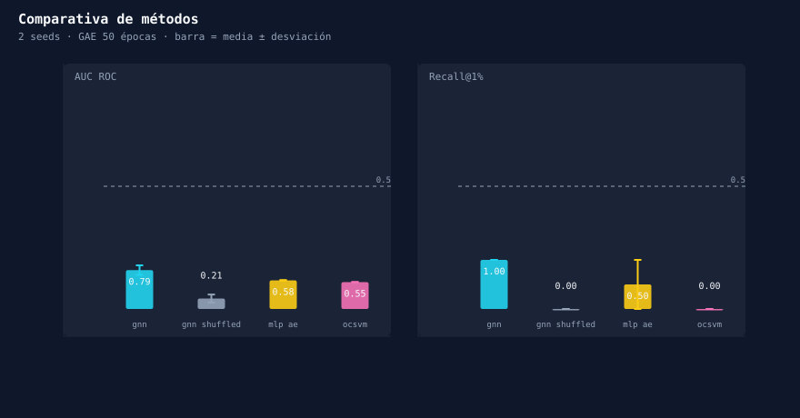
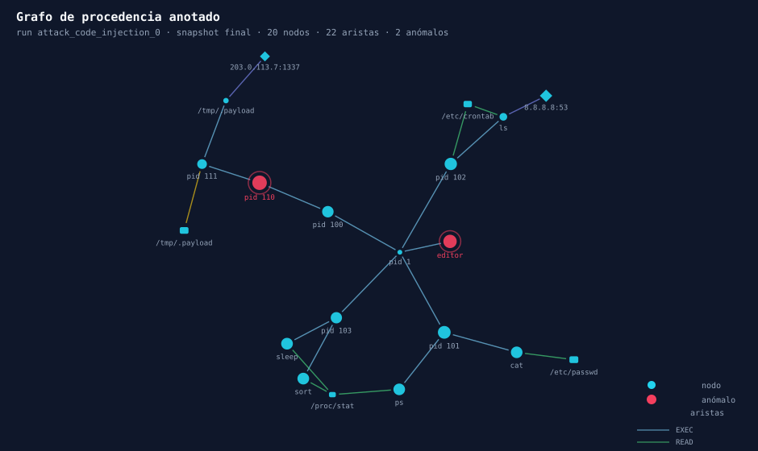
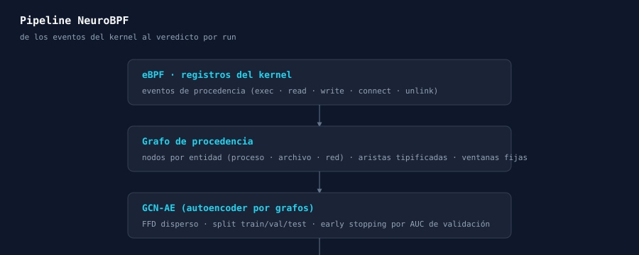

<p align="center">
  
  
  
  
  
</p>

# 🛡️ NeuroBPF

## Detección de intrusiones a nivel de kernel con GNN sobre grafos de procedencia

**NeuroBPF** modela el *comportamiento normal* del kernel con un **autoencoder de grafos (GCN)** y
señala como anomalía todo lo que no encaja: **un detector que nunca ha visto un ataque y lo caza igualmente.**

Captura **eBPF** en vivo · grafos de procedencia temporales por entidad · reconstrucción con GNN
· veredicto y métricas de la literatura · consola web 2D/3D de inspección forense — todo reproducible
sobre datos sintéticos **y** sobre el benchmark **THEIA_E3 (DARPA Transparent Computing)**.

---

## ⚡ Por qué NeuroBPF

| | |
|---|---|
| 🧠 **Modela lo normal, detecta lo desconocido** | Se entrena **solo con runs normales**. Los ataques no vistos se detectan como desviación del comportamiento aprendido (shock patterns, scripts, exfiltración…). |
| 🔬 **Protocolo como paper** | Split limpio train/val/test por run, umbral calibrado en validación, métricas de la literatura (AUC, Recall@k, nDCG@5%, FPR@presupuesto) **por run**. |
| 🆚 **Baselines y ablación** | Comparamos con **OCSVM** y **MLP-autoencoder**, y **ablacionamos la topología** (aristas permutadas) para medir cuánto aporta el grafo de procedencia. |
| 🎯 **Benchmark real** | Adapter al dataset **THEIA_E3** (DARPA TC): mismo pipeline, cero cambios. |
| 🕸️ **Inspección forense** | Consola web con timeline, grafo 2D/3D, comparativa de métodos y detalle por nodo. |

---

## 📊 Resultados medidos

Bar-chart generado con **datos reales del propio repo** (técnica de *literate figures*: se regenera con
`python scripts/figures.py`). El autoencoder bate a las baselines y la degradación al permutar las
aristas confirma que **el grafo de procedencia aporta** la señal:



> Métricas por método (media ± desviación entre seeds) sobre `report.json`. Regenera en tu máquina:
> `python scripts/figures.py --report data/report.json --annotations data/annotations`.

---

## 🕸️ Inspección visual de un ataque capturado

Snapshot real de un run de **code injection**: los nodos anómalos (score de reconstrucción por encima
de umbral normalizado) resaltan en rojo sobre el grafo de procedencia:



La consola web lleva esto a navegación completa: timeline con scrub, grafos 2D/3D con filtros,
búsqueda por nodo y comparativa de métodos.

---

## 🏗️ Arquitectura



Los datos reales (eBPF) y los sintéticos comparten el **mismo esquema NDJSON**: el resto del pipeline
es idéntico para ambos.

En detalle:

- **GNN**: autoencoder de reconstrucción (pila de GCN + producto interno) entrenado solo con runs normales.
- **Score de nodo**: error de reconstrucción BCE de las aristas dado el nodo.
- **Umbral**: percentil 99 de los z-scores por run normales (la normalización por run lo hace invariante
  al tamaño del grafo: un ataque acumulado no marca todo el grafo).
- **Métricas de paper** (`run_level_evaluate`, agrupadas por `run_id`):
  AUC ROC · precision@1 % · recall@1 % y @5 % · nDCG@5 % · FPR@presupuesto (1/5/10) · informe de umbral.

### Baselines y ablación

- **OCSVM** (`nu=0.1`) y **MLP-autoencoder** — comparadores solo de features, sin topología.
- **Ablación de topología** (`shuffled_graphs`): permutación determinista de aristas → cuánto aporta la topología.

---

## 🚀 Reproducción en 3 comandos

Requiere Python 3.12+ y Linux (la demo sintética no necesita eBPF ni root).

```bash
python -m venv .venv && source .venv/bin/activate && pip install -e .

# 1) Protocolo experimental multi-seed: GNN vs GNN-shuffled vs OCSVM vs MLP-AE
python -m neurobpf.cli compare --graphs data/graphs.pkl --out data/report.json --seeds 5 --epochs 300

# 2) Pipeline end-to-end (genera → entrena → detecta → anota) + dashboard
python -m neurobpf.cli demo --out data --seed 7 --normal 6 --attack 3 --serve
#    -> abre http://localhost:8899
```

### THEIA_E3 / DARPA TC

`neurobpf/benchmark/theia.py` convierte los JSONL de THEIA_E3 al mismo esquema NDJSON (igual que el
colector y el motor sintético). Las ground truths (`theia_ground_truth_to_pids`) se traducen a
`malicious_pids` por run. El escenario (~12 GB) queda fuera del repo.

---

## 🗂️ Estructura

```
ebpf/            Colector eBPF en C (libbpf): file_read, file_write, net_connect, process_start
neurobpf/        Pipeline Python: eventos, grafos, escenarios, GNN, servidor
  events.py        esquema canónico + I/O NDJSON
  graphbuilder.py  snapshots de procedencia temporales
  scenarios.py     simulador normal + 5 escenarios de ataque
  cli.py           generate / build / train / detect / annotate / demo / serve / compare
  gnn/             features, model (GAE), dataset, train, detect, baselines, ablation
  benchmark/       adapter THEIA_E3 (DARPA TC)
  server.py        FastAPI + API REST + WebSocket de replay
web/             Frontend Vite + React: timeline, grafo 2D/3D, baselines, detalle por nodo
assets/          Figuras del README (generadas por scripts/figures.py)
scripts/         Generador reproducible de figuras
tests/           Suite pytest (127 tests)
```

## 🔬 Tests

```bash
pytest                 # 127 tests: pipeline, métricas, baselines, API REST, figuras
cd web && npm test     # 13 tests de lógica del dashboard
```

## 🔧 Más

- **Captura real eBPF**: `make -C ebpf` después `sudo ./ebpf/collector > /tmp/live.events.ndjson`, luego
  `python -m neurobpf.cli build --events /tmp/live --out data/live.pkl` y `annotate`/`serve`.
- **Frontend**: `cd web && npm install && npm run build` (genera `web/dist`, sirve en el mismo origen).
- **Escenarios de ataque simulados**: code injection · exfiltration · lateral movement · persistence · supply chain.

---

<p align="center">
  <b>¿Te resulta útil para tu pipeline de detección o tu paper?</b><br/>
  Dale <b>⭐</b> para ayudar a la investigación reproducible con grafos de procedencia.<br/>
  <i>NeuroBPF alimenta — NeuroBPF vive de tu star.</i>
</p>